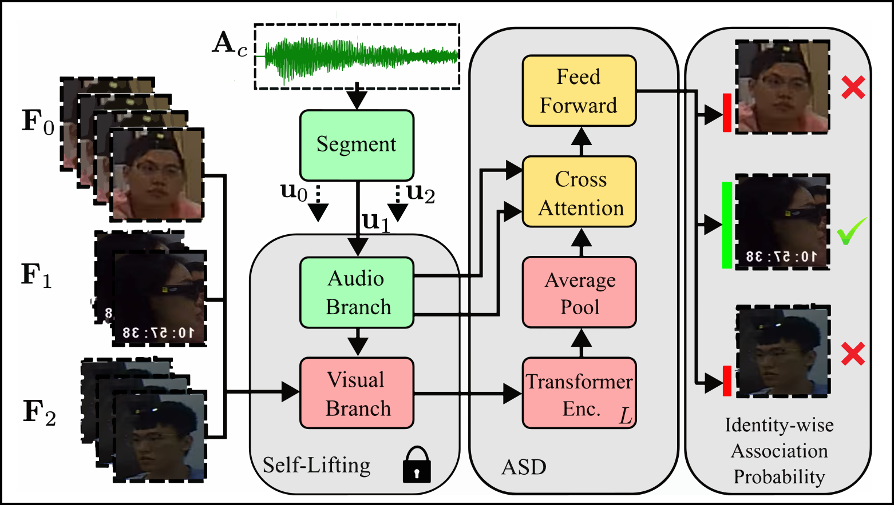

# Face-Voice Association for Audiovisual Active Speaker Detection in Egocentric Recordings

This repository implements a pipeline for audiovisual active speaker detection in egocentric recordings, based on the paper Face-Voice Association for Audiovisual Active Speaker Detection in Egocentric Recordings accepted to EUSIPCO 2025. 

---

## 📌 Overview

The pipeline consists of three major stages:
1. **Annotation preprocessing, audio segmentation, and bounding box extraction**
2. **Embedding extraction for both voice and face**
3. **Model training SL-ASD Decoder**

<p align="center">
  
</p>

---

## ⚙️ Installation

To reproduce environment:

### To install:
```bash
conda env create -f SL_ASD_environment.yml
conda activate <your-env-name>
```

---

## 🗂 Directory Structure
```
.
├── configs/                      # Contains all YAML config files
├── preprocess_scripts/          # Preprocessing scripts
├── emb_extractors/              # Embedding extraction scripts
├── utils/                       # Utility scripts
├── models/                      # Training and model-related code
├── outputs/                     # Outputs from preprocessing and training
├── visualisations/              # Optional visual outputs
└── README.md
```

---

## 🚀 Usage Guide

### 1. Preprocess Annotations and Segment Utterances

This step creates the required metadata and clips audio where a visible speaker is present.

#### a. Modify the Config
Edit `configs/preprocess_annot.yml`:
- Set all required paths as indicated by the inline comments.
- If running for the first time:
  - Set `process_images: True` to extract face crops from full-scene images.
  - Provide paths to full-scene images.

#### b. Run the Preprocessing Script
Choose your segmentation method:

- **Using pyannote segmentation:**
  ```bash
  cd preprocess_scripts
  python preprocess_annot_pyannote.py
  ```

- **Using ground truth segmentation:**
  ```bash
  cd preprocess_scripts
  python preprocess_annot_gt.py
  ```

---

### 2. Extract Embeddings

#### a. Voice Embeddings
1. Edit `configs/voice_extract.yml` to set input and output paths.
2. Run:
   ```bash
   cd emb_extractors
   python 2_extract_voice_emb.py
   ```

#### b. Face Embeddings
1. Edit `configs/face_extract.yml` accordingly.
2. Run:
   ```bash
   cd emb_extractors
   python 1_extract_face_emb.py
   ```

---

### 3. Train the Model

1. Edit `configs/sl_ASD.yml`, setting paths to the outputs from the preprocessing stage.
2. Train the model:
   ```bash
   python train.py
   ```

---

## 📈 Results & Evaluation

Shown in published technical paper soon.

---

## 📚 Citations

If you use this work, please cite the associated publication(s):

```bibtex
@inproceedings{clarke2025EUSIPCO_FaceVoiceAssociatuon,
      title={{Face-Voice Association for Audiovisual Active Speaker Detection in Egocentric Recordings}}, 
      author={{Authors of this paper (author names redacted, will be added in final version of this paper)}},
      year={2025},
      booktitle = {Submitted to European Signal Processing Conference (EUSIPCO)},
      location = {Palermo, Italy},
}

@inproceedings{Self-Lifting,
author = {Chen, Guangyu and Zhang, Deyuan and Liu, Tao and Du, Xiaoyong},
title = {Self-Lifting: A Novel Framework for Unsupervised Voice-Face Association Learning},
year = {2022},
isbn = {9781450392389},
publisher = {Association for Computing Machinery},
address = {New York, NY, USA},
url = {https://doi.org/10.1145/3512527.3531364},
doi = {10.1145/3512527.3531364},
booktitle = {Proceedings of the 2022 International Conference on Multimedia Retrieval},
pages = {527–535},
numpages = {9},
keywords = {cross-modal matching, cross-modal retrieval, unsupervised learning, voice-face association},
location = {Newark, NJ, USA},
series = {ICMR '22}
}
```

---

## 🧠 Acknowledgements

- This project builds on [pyannote-audio](https://github.com/pyannote/pyannote-audio) for voice activity detection and speaker segmentation.
- Face embedding extraction uses [InsightFace](https://github.com/deepinsight/insightface) or similar pre-trained models.
- The speaker recognition embedding extraction uses [ECAPA-TDNN from SpeechBrain](https://github.com/speechbrain/speechbrain/tree/develop)

---

## 📬 Contact

For questions or collaboration inquiries, please contact [jclarke8@sheffield.ac.uk].